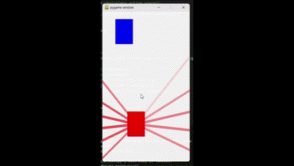

# Self Driving Car DQN
## This program uses pytorch and reinforcement learning to teach a car to drive itself. This is my first time using reinforcement learning, and it came with it's challenges. After lots of trial and error, the car was able to learn to drive almost perfectly using 15 sensors. The input to the network was the amount of distance an object was away from the sensors, and the output was a direction (Left, Right, Do Nothing).

# Training
## First, I created the class "Car", which contained all of the necessary information/functions for cars. The Environment was set to have 3 lanes, and cars would spawn everytime the car before would get 3 car lengths down the screen. This was perfect for making a challenging but doable environment for my car to learn in. The car's reward started at 1 and would subtract 2 for every collision with a car, and 20 for every collision with a wall. This was perfect for the car to learn.

# Final Result

# Training Plot

